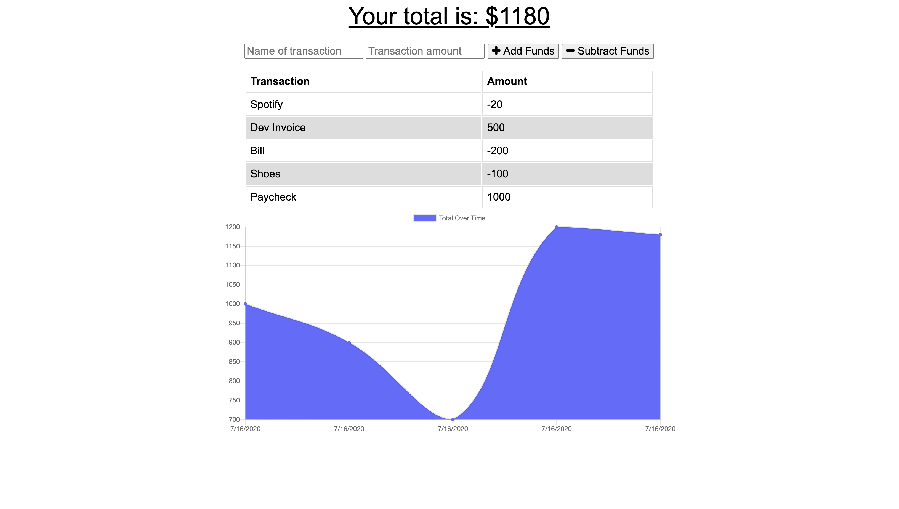
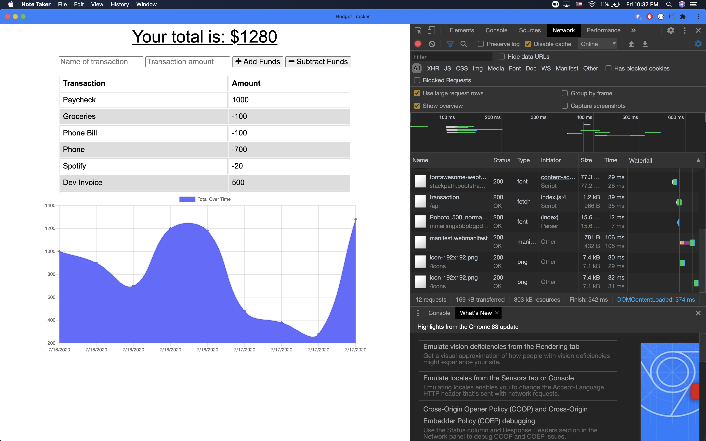

# Workout Tracker

# **Project Description**
A PWA Budget Tracker using mongoDB and indexedDB.

# **Live Link**
[Heroku](https://guarded-river-16272.herokuapp.com/)

# **Screencaps:**
  

  

# **Demo Video:**
[https://drive.google.com/file/d/1GNif2rmHcXQnj5lQVoHngoq3yb5_-mxa/view]

# **Installation**
Download the zip file and unzip it. Open the files and run npm install to intall the required dependencies. Then run npm start and navigate to your local host. Alternatively you can use the app in browser on the deployed Heroku page listed above.

# **Technology Stack**
* MySQL
* JavaScript
* Node
* Express
* MongoDB
* Mongoose
* IndexedDB

# **Contact**
* ### **Name:**  Morgan Splawn
* ### **Github:**  [@msplawn](https://github.com/msplawn)
* ### **Email:**  [mmsplawn@gmail.com](msplawn@gmail.com)
* ### **LinkedIn:**  [https://www.linkedin.com/in/morgan-splawn-72979a1a9/](https://www.linkedin.com/in/morgan-splawn-72979a1a9/)

